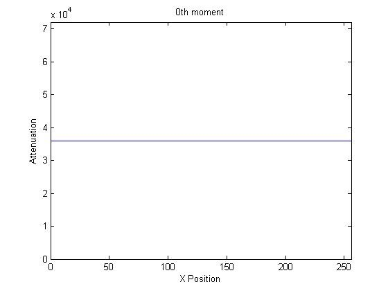

# Computed Tomography Image Reconstruction
## Introduction
Computed tomography is a collection of X-ray images stacked together in order to get the depth information as the third dimension of a diagnostic image. These "stacked" X-ray images are received as a sinogram from the CT gantry, and represent the X-ray absorption profile of a single layer of the subject. The objective of this project was to re-construct the original 2D image of this single layer and also distinguish between different X-ray absorption levels by the subject's tissues using light attenuation information. 

Below we see an example of how a sinogram (right) is formed by passing X-ray beams through a cross sectional layer of the body (left), with the X-ray absorption from each angle generating a graph of attenuation profile.

<p align="center">

</p>

## Project Details
The X-ray projection of the object at each angle of the CT gantry rotation produces a sinogram where the Y axis shows the angle in degrees while the X axis shows the spatial distance. 

I've created a sample sinogram and the goal of this project is to construct its corresponding phantom object. We'll be determining the X-ray attenuation through the different layers within the phantom and thereby get object density profile for the object. 


Input Sinogram             |  Output should be close to
:-------------------------:|:-------------------------:
  |  


## Zeroth Moment
<p align="center">

</p>

The 0th moment, as shown in the figure above is the response of the CT detectors when X-rays first hit them at each angle. This would be the sum of attenuation amplitude (Y axis) at each angle (X axis) and therefore will be the sum of each of the 256 angular projected columns of the sinogram. 


>The striking result of it being a flat line is because no matter which angle the projection is being taken from, the sum of the attenuation intensity will be constant since the object features are static.

## Simple Back-Projected Image
A simple back-projection is computed by overlaying projections on top of each other which create a concentration gradient for all the components of the image. A single column will contain the attenuation information for a single angular projection. There are 256 angular projections in total which correspond to the 180 degree shown on the sinogram. 

We therefore select one column at a time, smear the attenuation magnitude information over 128 rows and then rotate it to the angle which corresponds to in degrees (256th projection corresponds to 180 degrees, so nth projection will correspond to n*180/256 degrees). 

<p align="center">

</p>

> Not close enough to the real output image, but certainly a step closer!
The specific ‘greyness’ is added again and again every time a new projection smear is added to the old one. This makes the dark spots to show relatively dark and the light spots will show relatively light on the back-projected image.

## The Ram-Lak Filter
For carrying out filtered back-projection of the sinogram, we need to construct the filter that we will be using in frequency domain. This will help us easily multiply it to the Fourier transformed sinogram instead of performing convolution. The filter response is then multiplied with a Fourier transformed (and shifted) sinogram. The result to this is a Ram-Lak (high-pass filter) filtered sinogram, in frequency domain and all zero frequencies centered. 

To get the original frequency distribution, we inverse-Fourier-shift and then inverse-Fourier-transform it to later get the spatial domain sinogram. We see how the filter response is far more selective than the non-fitlered couterpartand we can see there are amplitude spikes when an edge is detected.

Filtered Sinogram             |  Filtered vs Original
:-------------------------:|:-------------------------:
  |  

<p align="center">

</p>

> As compared to our simple back-projected image, we see that the Ram-Lak filter has been able to remove low frequency noise (haze), improve contrast, thereby improving the total signal-to-noise ratio. The resolution also seems to have increased but mainly due to the increased sharpness and improved contrast.

## Compare to Hamming

Lets also explore MATLAB's inbuilt functions to do this. We use the Radon and inverse Radon transforms for this purpose.

```matlab
theta=0:180;                    
[R,rad_angles]=radon(phantom,theta);    % as shown in radon help file

imagesc(rad_angles,theta,R'); colormap('gray');  
title('Sinogram Generated Using radon Function')
xlabel('Position')
ylabel('Angle')

RamLak_filtered=iradon(R, theta, 'linear','Ram-Lak', 1.0, size(phantom,1));
imagesc(RamLak_filtered); colormap('gray');  
title('Filtered Backprojection Using iradon Function and Ram-Lak Filter')
xlabel('Position')
ylabel('Position')

Hamming_filtered=iradon(R, theta, 'linear','Hamming', 1.0, size(phantom,1));
imagesc(Hamming_filtered); colormap('gray');
title('Filtered Backprojection Using iradon Function and Hamming Filter')
xlabel('Position')
ylabel('Position')
```

Ram-Lak Filtered Output             |  Hamming Filtered Output
:-------------------------:|:-------------------------:
  |  

Ram-Lak filter being a high pass filter as compared to the mid-frequency pass Hamming filter, we see the Ram-Lak filtered image has sharper features than the Hamming filtered image. So to have better sharpness and better resolution on medical images, Ram-Lak filter would be the better fit.


## Have fun

If you want to try reconstructing images from your own sinogram database, go ahead! 
Fiddle with the parameters and try different filters to see how the result image varies.

Installations Required:
- MATLAB
